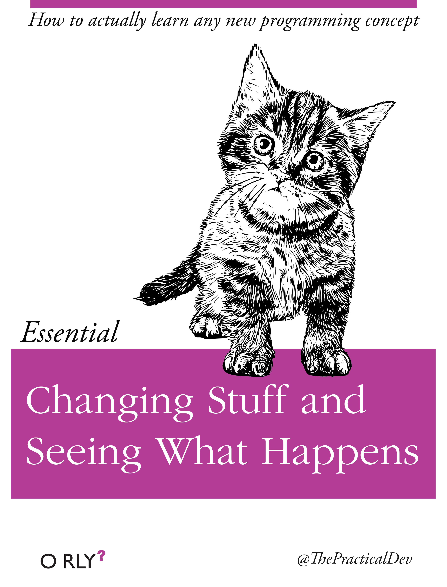

Because I want to be comfortable with react, I chose to build this site with [Gatsby](https://www.gatsbyjs.org/), a "Blazing-fast static site generator for React".  It's undoubtedly a good tool, but in retrospect, looking at the time I spent, it may have been a mistake.  

I'm sure I learn a lot about project structure and best practices - or at least something- but the nature of code is that some things will always be abstracted away.  This is a good thing.  There are no universalists anymore.  The drawback, for me, is that I didn't have a good enough understanding of React going into the project, and thus was unaware of what were aspects of React design, and what were design choices made (no dobut, wisely) behind the scene by the Gatbsy team.  

It's the trade off between magic and boilerplate.  Too much magic meant I was unable to find things to tweak basic setting.

This was made worse by trying to learn so many technologies simultaneously.  I'm still getting my head around graphql, though I see the advantages.  I am by no means good with CSS, and here it's mixed up in styled components to render in JSX.

Overall, this has helped me learn how to learn.  

Going forward, I want to isolate the thing I'm learning and really play with it.  

           